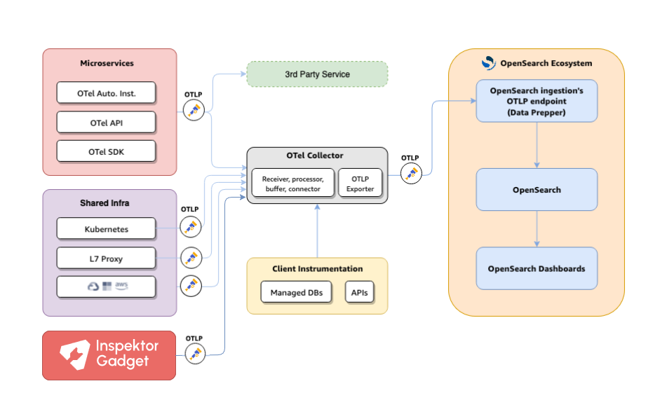

# Inspector Gadget eBPF Integration for OpenTelemetry Demo

This fork demonstrates zero-code eBPF instrumentation by integrating [Inspektor Gadget](https://inspektor-gadget.io/) with the OpenTelemetry Demo application. This implementation provides system-level observability that complements the existing application telemetry, offering insights into CPU profiling, network connections, and out-of-memory events directly from the kernel.

## Overview

This integration adds three Inspector Gadget containers that run eBPF programs to collect system-level telemetry data and export it to the OpenTelemetry Collector in OTLP format. The data is then processed through Data Prepper and stored in OpenSearch, where it can be visualized alongside traditional application telemetry.



## What's Added

### eBPF Instrumentation Containers

Three specialized Inspector Gadget containers run continuously to monitor different aspects of system behavior:

1. **`ig-cpu`** - CPU profiling using `profile_cpu` gadget
2. **`ig-oom`** - Out-of-memory kill tracking using `trace_oomkill` gadget  
3. **`ig-tcp`** - TCP connection tracing using `trace_tcp` gadget

### Enhanced Configuration

- **OpenSearch Dashboards** enhanced with workspace support and query enhancements

### Pre-built Dashboards

The integration includes a comprehensive dashboard (`export.ndjson`) with visualizations for:

- **Active Containers** - Count of running containers
- **TCP Connections by Container** - Heatmap of network connections and errors
- **Network Flow Visualization** - Sankey diagram showing container-to-destination traffic
- **Website Request Patterns** - Time series of frontend proxy requests
- **CPU Consumption** - CPU usage profiling by container over time
- **CPU Profile Details** - Detailed CPU profiling information
- **OOM Process Monitoring** - Out-of-memory events tracking
- **OOM Kernel Stack** - Detailed OOM event information

## Architecture

```
┌─────────────────┐    ┌──────────────────┐    ┌─────────────────┐
│   Application   │    │  OpenTelemetry   │    │  Data Prepper   │
│   Services      │───▶│    Collector     │───▶│   Processing    │
└─────────────────┘    │   (Port 4317)    │    └─────────────────┘
                       └──────────────────┘             │
┌─────────────────┐             ▲                       ▼
│  Inspector      │             │              ┌─────────────────┐
│  Gadget eBPF    │─────────────┘              │   OpenSearch    │
│  Containers:    │                            │   + Dashboards  │
│  • ig-cpu       │                            └─────────────────┘
│  • ig-oom       │
│  • ig-tcp       │
└─────────────────┘
         │
┌─────────────────┐
│  Linux Kernel   │
│  eBPF Programs  │
└─────────────────┘
```

## Prerequisites

- **Docker**: Version 20.10+
- **Docker Compose**: Version 2.0+
- **Linux Host**: Required for eBPF functionality (Inspector Gadget containers run with `privileged: true`)
- **Host Network Access**: Containers use `network_mode: "host"` for kernel access

## Quick Start

1. **Clone the repository**:
   ```bash
   git clone https://github.com/ps48/opentelemetry-demo.git
   cd opentelemetry-demo
   git checkout inspektor-gadget
   ```

2. **Start the enhanced demo**:
   ```bash
   docker compose up -d
   ```

3. **Generate some traffic** to see the eBPF data:
   ```bash
   # Visit the web store to generate network traffic
   curl http://localhost:8080
   
   # Or use the load generator if available
   docker compose run loadgenerator
   ```

4. **Access the dashboards**:
   - **Astronomy Shop**: http://localhost:8080
   - **OpenSearch Dashboards**: http://localhost:5601
   - **Jaeger**: http://localhost:16686

5. **Import the eBPF dashboard**:
   - In OpenSearch Dashboards, go to Management → Saved Objects
   - Import the `assets/export.ndjson` file
   - Navigate to the "OTel Demo - eBPF" dashboard

## Configuration Details

### Inspector Gadget Configuration (`ig-config-minimal.yaml`)

```yaml
operator:
  otel-logs:
    exporters:
      my-log-exporter:
        exporter: otlp-grpc
        endpoint: "0.0.0.0:4317"
        insecure: true
```

### Container Specifications

#### CPU Profiling Container (`ig-cpu`)
```yaml
ig-cpu:
  image: ghcr.io/inspektor-gadget/ig:latest
  privileged: true
  pid: "host"
  network_mode: "host"
  command: >
    run profile_cpu:latest 
    --config /config/ig-config-minimal.yaml
    --otel-logs-exporter=my-log-exporter
    --annotate "samples:logs.body=\"kern_stack: \" + kern_stack,..."
```

#### OOM Kill Tracking Container (`ig-oom`)
```yaml
ig-oom:
  image: ghcr.io/inspektor-gadget/ig:latest
  privileged: true
  pid: "host" 
  network_mode: "host"
  command: >
    run trace_oomkill:latest
    --config /config/ig-config-minimal.yaml
    --otel-logs-exporter=my-log-exporter
    --annotate "oomkill:logs.body=\"Process= \" + fprocess.comm,..."
```

#### TCP Connection Tracing Container (`ig-tcp`)
```yaml
ig-tcp:
  image: ghcr.io/inspektor-gadget/ig:latest
  privileged: true
  pid: "host"
  network_mode: "host"
  command: >
    run trace_tcp:latest
    --config /config/ig-config-minimal.yaml
    --otel-logs-exporter=my-log-exporter
    --annotate "tracetcp:logs.body=\"Process= \" + proc.comm,..."
```

### Data Processing Pipeline

The integration modifies the Data Prepper configuration to handle both application and eBPF telemetry:

- **Logs Pipeline**: `otel_logs_source` → OpenSearch (`log-analytics` index)
- **Traces Pipeline**: `otel_trace_source` → Raw pipeline + Service map → OpenSearch

## Dashboard Visualizations

### Network Analysis
- **TCP Connections Heatmap**: Shows connection patterns and errors by container
- **Network Flow Sankey**: Visualizes traffic flows between containers and destinations
- **Website Request Timeline**: Tracks frontend proxy requests over time

### Performance Monitoring
- **Active Container Count**: Real-time count of running containers
- **CPU Consumption Timeline**: CPU usage patterns by container
- **CPU Profile Table**: Detailed CPU profiling data with kernel stack traces

### System Health
- **OOM Event Monitoring**: Tracks out-of-memory kills by container and time
- **OOM Kernel Stack**: Detailed information about OOM events

## Data Schema

The eBPF data is exported as OpenTelemetry logs with rich attributes:

### Common Attributes
- `log.attributes.containerName` - Container generating the event
- `log.attributes.containerId` - Container ID
- `log.attributes.containerImageName` - Container image
- `log.attributes.pid` - Process ID
- `log.attributes.runtimeName` - Container runtime

### TCP Trace Specific
- `log.attributes.src.addr` / `log.attributes.src.port` - Source address/port
- `log.attributes.dst.addr` / `log.attributes.dst.port` - Destination address/port
- `log.attributes.type` - Connection type
- `log.attributes.error` - Error information

### CPU Profile Specific
- `body` - Kernel stack trace information
- CPU sampling data with process context

### OOM Kill Specific  
- `body` - Process information for killed process
- `log.attributes.containerStartedAt` - Container start time

## Querying the Data

Use PPL (Piped Processing Language) queries in OpenSearch Dashboards:

### Active Containers
```sql
source = logs-otel-v1-* 
| where serviceName = 'inspektor-gadget'
| where instrumentationScope.name = 'trace_tcp'
| dedup log.attributes.containerName
| stats count(log.attributes.containerName)
```

### TCP Connections by Container
```sql
source = logs-otel-v1-* 
| where serviceName = 'inspektor-gadget'
| where instrumentationScope.name = 'trace_tcp'
| stats count() by log.attributes.error, log.attributes.containerName
```

### CPU Usage Over Time
```sql
source = logs-otel-v1-* 
| where serviceName = "inspektor-gadget" 
| where match(body, "[0]")
| where log.attributes.containerName in ('ad', 'accounting', 'cart', 'currency', 'shipping', 'product-catalog', 'image-provider')
| stats count() as `count` by span(time, 1m), log.attributes.containerName
```

## Troubleshooting

### Common Issues

1. **eBPF Programs Not Starting**
   ```bash
   # Check if containers are running
   docker ps | grep ig-
   
   # Check container logs
   docker logs ig-cpu
   docker logs ig-oom  
   docker logs ig-tcp
   ```

2. **No Data in OpenSearch**
   ```bash
   # Verify OpenTelemetry Collector is receiving data
   docker logs otel-collector
   
   # Check Data Prepper logs
   docker logs data-prepper
   ```

3. **Permission Issues**
   - Ensure Docker has permission to run privileged containers
   - Verify the host system supports eBPF (kernel 4.18+)

### Verifying eBPF Functionality

```bash
# Check if eBPF programs are loaded
sudo bpftool prog list

# Monitor system calls (if available)
sudo strace -e trace=bpf -p $(pidof ig)
```

## Development and Customization

### Adding New Gadgets

To add additional Inspector Gadget monitoring:

1. Add a new service in `docker-compose.yml`:
   ```yaml
   ig-new-gadget:
     image: ghcr.io/inspektor-gadget/ig:latest
     privileged: true
     pid: "host"
     network_mode: "host"
     volumes:
       - /:/host
       - ./ig-config-minimal.yaml:/config/ig-config-minimal.yaml
     command: >
       run your_gadget:latest 
       --config /config/ig-config-minimal.yaml
       --otel-logs-exporter=my-log-exporter
       --annotate "your_annotations"
   ```

2. Update the dashboard configurations in `assets/export.ndjson`

### Customizing Annotations

The `--annotate` flags control how eBPF data is mapped to OpenTelemetry log attributes. Modify these to:
- Change log message format (`logs.body`)
- Map different fields to log attributes (`field:logs.name=attribute_name`)
- Filter or transform the data

## Performance Considerations

- **Resource Usage**: eBPF programs have minimal overhead, but the containers require privileged access
- **Data Volume**: TCP tracing can generate significant data in high-traffic environments
- **Storage**: Consider log retention policies for OpenSearch indices

## Security Notes

- Inspector Gadget containers run with `privileged: true` and host network access
- This is required for eBPF functionality but increases attack surface
- Use appropriate network segmentation and access controls in production

## Resources

- [Inspector Gadget Documentation](https://inspektor-gadget.io/docs/)
- [OpenTelemetry Demo Documentation](https://opentelemetry.io/docs/demo/)
- [OpenSearch PPL Reference](https://opensearch.org/docs/latest/search-plugins/ppl/index/)
- [eBPF Technology Overview](https://ebpf.io/what-is-ebpf/)